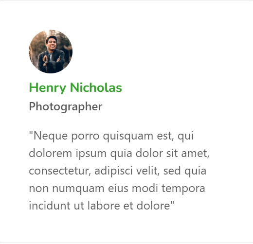

<!DOCTYPE html>
<html lang="en">
<head>
    <meta charset="UTF-8">
    <meta name="viewport" content="width=device-width, initial-scale=1.0">
    <title>Website</title>
    
</head>
<body>
    

        

            <h1>Apil Adhikari</h1>
            

                <a href="#">Home</a>
                <a href="#">About</a>
                <a href="#">Services</a>
                

                    <a href="#">Pages</a>
                    

                        <a href="#">Blog</a>
                        <a href="#">Single Blog</a>
                        <a href="#">Landing page</a>
                    

                

                <a href="#">Contact</a>
            

        

        

            
            <h1></h1>
        

        

            <h1>My name is KP Oli</h1>
            <h2>I am a Web Developer</h2>
        

        

            

                <h1>Welcome to my website</h1>
                
Vestibulum ante ipsum primis in faucibus orci luctus et ultrices posuere cubilia Curae; Nulla mollis dapibus nunc, ut rhoncus turpis sodales quis. Integer sit amet mattis quam.Vestibulum ante ipsum primis in faucibus orci luctus et ultrices posuere cubilia Curae; Nulla mollis dapibus nunc

            

            

            

                <h3>Design</h3>
                

                    

                

            

            

                <h3>Marketing</h3>
                

                    

                

            

            

                <h3>Photography</h3>
                

                    

                

            

            

            

                

                    <h3>Branding</h3>
                    

                        

                    

                

                

                    <h3>Softwarica</h3>
                    

                        

                    

                

                

                    <h3>Pokhara</h3>
                    

                        

                    

                

                

        

    

    

        

            <h1>I'm Available For Hire</h1>
            
Vestibulum ante ipsum primis in faucibus orci luctus et ultrices posuere cubilia Curae; Nulla mollis dapibus nunc, ut rhoncus turpis sodales quis. Integer sit amet mattis quam.

              
        

        

            

                

                    
                    <h2>Design</h2>
                    
Vestibulum ante ipsum primis in faucibus orci luctus et ultrices posuere cubilia Curae; Nulla mollis dapibus nunc

                

            

            

                

                    
                    <h2>Marketing</h2>
                    
Vestibulum ante ipsum primis in faucibus orci luctus et ultrices posuere cubilia Curae; Nulla mollis dapibus nunc

                

            

            

                

                    
                    <h2>Photography</h2>
                    
Vestibulum ante ipsum primis in faucibus orci luctus et ultrices posuere cubilia Curae; Nulla mollis dapibus nunc

                

            

        

    

    

        <h1>I love what I do</h1>
        
Vestibulum ante ipsum primis in faucibus orci luctus et ultrices posuere cubilia Curae; Nulla mollis dapibus nunc, ut rhoncus turpis sodales quis. Integer sit amet mattis quam.

         
         
        

            

                Projects
            

            

                Illustrations
            

            

                Photography
            

            

                Website
            

        

         
         
        

            
            
            
               
        

        

            
            
            
        

    

    

        

            <h1>Experience</h1>
             
             
            
2018 - now

            <h3>Full-time Freelancer</h3>
            
Sed ut perspiciatis unde omnis iste natus error sit voluptatem accusantium doloremque laudantium, totam rem aperiam, eaque ipsa quae ab illo inventore veritatis et quasi architecto beatae.

            

             
            
2016 - 2018

            <h3>Creative Director at Pixar Studio</h3>
            
Accusantium doloremque laudantium, totam rem aperiam, eaque ipsa quae ab illo inventore veritatis et quasi architecto.

            

             
            
2014 - 2016

            <h3>Senior Designer at Google</h3>
            
Accusantium doloremque laudantium, totam rem aperiam, eaque ipsa quae ab illo inventore veritatis et quasi architecto.

            

        

        

            <h1>Education</h1>
             
             
            
2010

            <h3>Master Degree in Computer Science</h3>
            
Sed ut perspiciatis unde omnis iste natus error sit voluptatem accusantium doloremque laudantium, totam rem aperiam, eaque ipsa quae ab illo inventore veritatis et quasi architecto beatae.

            

             
            
2008

            <h3>Bachelor Degree in Computer Science</h3>
            
Sed ut perspiciatis unde omnis iste natus error sit voluptatem accusantium doloremque laudantium, totam rem aperiam, eaque ipsa quae ab illo inventore veritatis et quasi architecto beatae.

            

             
            
2004

            <h3>High School Graduation</h3>
            
Sed ut perspiciatis unde omnis iste natus error sit voluptatem accusantium doloremque laudantium, totam rem aperiam, eaque ipsa quae ab illo inventore veritatis et quasi architecto beatae.

            

        

    

    

        <h1>What people say about me</h1>
        
Vestibulum ante ipsum primis in faucibus orci luctus et ultrices posuere cubilia Curae; Nulla mollis dapibus nunc, ut rhoncus turpis sodales quis. Integer sit amet mattis quam.

         
        

            

                

                    
                

                

                    
                

                

                    
                

                

                    
                

                

                    
                

                

                    
                

            

        

    

    <footer class="footer">
        <a href="#" class="social-icons" target="_blank"><i class="fab fa-facebook"></i></a>
        <a href="#" class="social-icons" target="_blank"><i class="fab fa-twitter"></i></a>
        <a href="#" class="social-icons" target="_blank"><i class="fab fa-instagram"></i></a>
        <a href="#" class="social-icons" target="_blank"><i class="fab fa-linkedin"></i></a>
         
        

        

        

         
        
&copy; 2023 Your Website. All rights reserved.

    </footer>
    <link rel="stylesheet" href="https://cdnjs.cloudflare.com/ajax/libs/font-awesome/6.0.0-beta3/css/all.min.css">

</body>
</html>
